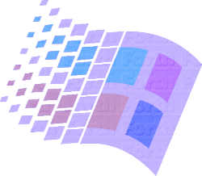

# Winforth

<center>

</center>

A Forth implementation in C++, built on Windows 98.

## What is Forth?

Forth is a family of languages with many implementations, known for being minimal and for working mainly by manipulating certain data structures such as a stack and a dictionary.

The dictionary is comprised of user-defined words. Defining a word is to associate another set of words and commands to said word so that, during execution, the defined word is substituted by the given set of words that determine its meaning.

## Reasoning

This is a simple hobby project for implementing a Forth interpreter under Windows 98, using Visual C++ 6.0. The mentioned IDE is in no way limited, but I wanted to explore how much I could do with Visual C++ 6.0, given the well-known fact that this implementation is not 100% compliant with the C++ spec at the time -- in fact, I heard that the STL is not even thread-safe.

I am also providing a Makefile for building this project on Linux.

## Documentation

This Forth implementation has the following characteristics, that might be unorthodox:

- It is case-sensitive;
- There is only integer arithmetic.

Part of these characteristics are derived from implementation constraints (such as time or laziness), and may change anytime.

### System data structures

This Forth implementation has the following data structures:

- A token stream, working as a word queue;
- A value stack, commonly referred as "stack" and containing cells;
- A data stack for memory allocation that provides memory with stack allocation only;
- A dictionary for words specifically, associating word names with a list of words, which is considered their definition;
- A dictionary for variables specifically, also known as the variable index, which associates a variable's name
- A string buffer, containing the last string defined by the `s"` word.

For implementation purposes, variable names take precedence over words, so while you may define words and variables with the same name, the interpreter will favor variables and ignore words in these cases.

### Primitive words

This Forth implementation is case-sensitive, and has the following built-ins.

Please notice that their behaviour is mostly described by stack operations (such as pushing and popping).

#### Constants

- `true`: Pushes -1 (all bits set).
- `false`: Pushes 0 (no bits set).
- `cell`: Pushes the cell size in bytes.

#### Words

- `.`: Pops the topmost value and prints to console.
- `dup`: Pushes a copy of the topmost stack value.
- `swap`: Switch places between the two topmost stack values.
- `rot`: Rotate the three topmost stack values. A stack containing numbers 1, 2, 3 (rightmost is stack top) becomes 2, 3, 1 -- in other words, the third value (counting from top to bottom) is moved to the top.
- `over`: Duplicates the second topmost number and pushes it. A stack containing numbers 1, 2 (rightmost is stack top) becomes 1, 2, 1.
- `drop`: Pops the topmost value.
- `and`: Consumes the two topmost values performing an "and" operation and pushes the result. This is also a bitwise operation.
- `or`: Consumes the two topmost values performing an "or" operation and pushes the result. This is also a bitwise operation.
- `xor`: Consumes the two topmost values performing an "exclusive or" operation and pushes the result. This is also a bitwise operation.
- `invert`: Consumes the topmost value performing a "not" operation and pushes the result. This is also a bitwise operation.
- `+`, `-`, `*`, `/`: Arithmetic words. Consume the two topmost values, and the operand order is determined by how deep the value is on stack (in other words, the second value counting from stack top is the first operand). For division (`/`), the second operand must not be zero.
- `<`, `<=`, `<>`, `>`, `>=`, `=`: Words for comparing integer numbers. These words consume the two topmost values, and the operand order is determined by how deep the value is on stack (in other words, the second value counting from stack top is the first operand). The result is then pushed.
- `.s`: Prints the stack to console.
- `emit`: Prints a character to console. Topmost value is considered the ASCII decimal value of the character.
- `!`: Stores a value on a given data address. See *"Memory allocation and variables"* for usage.
- `@`: Retrieves a value from a given data address. See *"Memory allocation and variables"* for usage.
- `here`: Pushes the first free address (address of next allocation) on data store.
- `allot`: Allocates or deallocates a given number of address units. See *"Memory allocation and variables"* for usage.
- `align`: Aligns the first free address (`here`) on the data store. See *"Memory allocation and variables"* for usage.
- `aligned`: Pushes to stack the first free aligned address on the data store. Must be greater or equal than the actual first free address (`here`).
- `constant`: Creates a new word on the variables dictionary, that points to the (assumed) address that is currently topmost on stack.
- `s"`: Reads a string from input and stores it on the string buffer. The string that was read will only live until the next call to `s"`, and is delimited by a whitespace after `s"` and a `"` character or a newline/end-of-file.
- `."`: Reads a string from input and immediately prints it to console. The string buffer is unaffected and the string does not live beyond its reading. The string is delimited by a whitespace after `."` and a `"` character or a newline/end-of-file.
- `loadfile`: Reads and evaluates a file. The file path must be on the string buffer.
- `bye`: Exits the interpreter.

Comparison and logic/bitwise words conform to pushing values like `true` or `false`, or `-1` and `0` respectively. Because of the binary representation of these values, the logic words also work seamlessly as bitwise operations.

#### Bootstrapped words

There are also a few words that are bootstrapped through the `init.fth` file:

- `cr`: Prints a new line on console by emitting characters '\n' and '\r' respectively.
- `?`: Shortcut for printing the contents of an address on the data store.
- `cells`: Multiplies the topmost number by the size of a cell.
- `,`: Allocates a single cell on the data store and writes the topmost value to it.
- `variable`: Defines a new zero-initialized variable. See "Memory allocation and variables" for usage.
- `1+`: Add 1 to topmost value.
- `1-`: Subtract 1 from topmost value.

Make sure you always load the `init.fth` file through command line or through the `loadfile` word.

### Syntax

Winforth works by pushing values onto the value stack to perform operations. For example, we can push the values 10 and 12 (on that order), then perform a sum with these numbers:

```fth
10 12 +
```

For this case, the values 10 and 12, that were on the stack, are completely consumed, and then the result of the sum is pushed atop the stack.

The resulting behaviour, given that the stack was empty at beginning, is a stack with a single value of 22.

It is also possible to perform certain manipulations using other predefined words. For example, we can square the number 5:

```fth
5 dup *
```

In this case, we push the number 5 atop the stack, and then we duplicate it by using the word `dup`; now the stack has the number 5 two times in it. Finally, we consume both these numbers and multiply them, leaving the value 25 on their place.

#### Memory allocation and variables

In Winforth, memory allocation is done by reserving a contiguous amount of allocation units at a time on the data store (which is manipulated like a stack).

Even though the sizes of an allocation unit or a cell is not particularly important for a Forth specification, Winforth establishes that an allocation unit has the size of a byte, while a cell has the size of a 64-bit number, or 8 bytes. Addresses (also known as a-addr and c-addr) also have the same size as a cell.

Let's say we're building an array of ten numbers, and so we want to reserve 10 cells. This can be easily done with `allot`:

```fth
10 cells allot
```

To deallocate these cells, given that *no more cells were allocated since then*, just pass a negative number of cells to `allot`.

```fth
-10 cells allot
```

If this syntax is a little too low-level, you may want to declare variables, or even store these allotted addresses on variables you declared.

In Winforth, variables are global values identified by a positive integer address. Each variable is declared through a textual alias, like the following example:

```fth
variable <variable-name>
```

After declaring a variable, you can reference it by name; referencing it will push the variable's address, which is just a positive integer value, so please be mindful of that.

The default value of any new variable is 0; the value of a variable can be queried by using the word `@` with the following syntax:

```fth
<varaddr> @
```

Similarly, a new value can be stored on a variable by using the word `!` with the following syntax:

```fth
<value> <varaddr> !
```

The following example creates a variable `sum`, stores the value of `2 * 3` in it, queries the value by pushing it onto the stack, and finally pops and prints the stored value.

```fth
variable sum

2 3 * sum !
sum @ .
```

If you're using the definitions in `init.fth`, you may even use a shortcut for retrieving and printing data from a variable:

```fth
variable sum

2 3 * sum !
sum ?
```


#### Comments

```fth
( This is a comment. )
```

Comments are delimited by parentheses (which must be surrounded by white space). They will be ignored by both the parser and the evaluator. A comment that starts in a line and ends in another one is considered a syntax error on the REPL.

#### Declaring words

```fth
: <word-name> <definition...> ;
```

New words can be added to Winforth's dictionary by using a word declaration syntax.

A word definition always starts with `:`, followed by a string that names the word. These two tokens are then followed by a series of any number of words, and will be the definition of the word being declared. Finally, a `;` token delimits the end of word definition.

Contrary to comments, word definitions can be multiline on the REPL.

It is a common pattern to describe the state of the meaningful portion of the stack on a comment in front of the word name:

```fth
: square ( x -- x2 )
  dup * ;

: sum-of-squares ( a b -- r )
  square swap square + ;
```

#### Conditionals

```fth
<predicate> if <consequent...> then
<predicate> if <consequent...> else <alternative...> then
```

There are two kinds of conditionals. The first one defines what to do when a certain condition is met; the second one does that, but also determines what to do otherwise.

The syntax of a conditional can be unorthodox in many levels. It is important to remember that a conditional such as this one in C++...

```cpp
if(value >= 0)
    return 1;
else
    return -1;
```

...can be written in Forth this way:

```fth
( value is topmost on stack )
0 >= if 1 else -1 then
```

#### Loops

Winforth has very basic support for loops -- and when we say **very basic**, we mean it. It is possible to declare nested loops syntactically in Winforth like any other Forth implementation, however these operate better when compiled, and this implementation of Winforth is actually an interpreter, so there is no proper way to know where each loop ends syntactically. This is why you cannot have nested loops.

It is possible to encapsulate repeated behaviour by using a definite loop.

A definite loop has the following syntax:

```fth
<limit> <index> do <behaviour...> loop
```

This structure will repeatedly execute the words represented by `<behaviour...>`, until `<index>` reaches the `<limit>` value.

The following example prints `"Hello world!"` on screen 10 times, followed by a line break:

```fth
10 0 do ." Hello world!" cr loop
```

The value of `<index>` is incremented by the end of execution of the behaviour's words, but the current value of an iteration is not available.

If you want to keep track of your iteration, you can do so by declaring your own variable. The following example will output values for the variable `i` on an inclusive range of `0..9`:

```fth
variable i
0 i !
10 0 do ." Iteration: " i ? cr i @ 1+ i ! loop
```

Declaring a loop with definite range is not the only looping method. It is also possible to declare an indefinite loop, which will repeat a certain behaviour until a condition is met.

The indefinite loop has a syntax as follows:

```fth
begin <behaviour...> <predicate...> until
```

The words `begin` and `until` are delimiters for the entire behaviour of the loop, however here some words that are part of the loop behaviour are described as `<predicate...>`. This is because the keyword `until` expects the last part of the loop to be something that evaluates to `true` (`-1`) or `false` (`0`).

If after executing the entire loop behaviour there is a `-1` atop the stack, the loop breaks; if, however, there is any other value, the loop iterates and the behaviour is executed again.

Below is an example that works just like the definite loop, but in an explicit manner: a variable `i` is declared, and its value is printed and then incremented. Afterwards, we check whether its value is `10` by using the `=` word. The result of this comparison is left on the stack, and is consumed by `until`.

```fth
variable i
0 i !
begin ." i = " i ? cr i @ 1+ i ! i @ 10 = until
```

**NOTE:** Due to their nature, it is possible to have a definite loop within an indefinite loop and vice-versa, but that's the most that this Winforth implementation can do, due to reasons already explained.

## Loading files

If you wish to load definitions from files at startup, just pass them as arguments from command line:

```
winforth.exe file1.fth file2.fth...
```

Especially, load the file `init.fth` for some Winforth basic bootstrapped words that might be useful, such as `cr` and `?`.

### Loading files at runtime

To load a file at runtime, use the `loadfile` command. This command is non-standard and uses a file path that should be stored on the string buffer by the `s"` word:

```fth
s" file.fth" loadfile
```

The file will be immediately evaluated as if its contents were typed on console.

## License

This project is distributed under the MIT License. See LICENSE file for more information.
